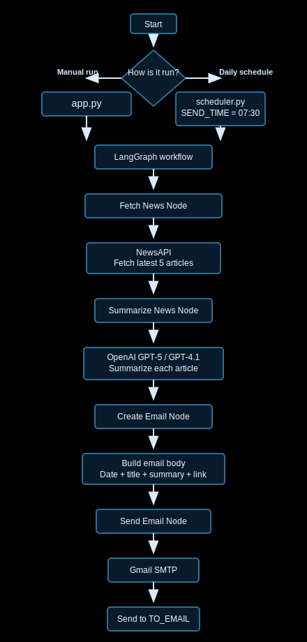

# Daily AI News Email Agent

A simple Python + LangGraph agent that fetches the latest news, summarizes it with OpenAI, builds a short email, and sends it through Gmail SMTP.

## Project Files

- `app.py` - runs the agent once and sends the email immediately
- `graph.py` - LangGraph workflow with fetch, summarize, create email, and send nodes
- `tools.py` - NewsAPI fetch logic and OpenAI summarization
- `email_sender.py` - Gmail SMTP email sender
- `scheduler.py` - daily scheduler that sends at a fixed time
- `requirements.txt` - Python dependencies
- `.env` - API keys and email settings

## Requirements

- Python 3.10 or newer
- NewsAPI key
- OpenAI API key
- Gmail account with 2-Step Verification enabled
- Gmail App Password

## Setup

1. Install dependencies:

```powershell
pip install -r requirements.txt
```

2. Fill in your `.env` file:

```env
OPENAI_API_KEY=your_openai_api_key_here
OPENAI_MODEL=gpt-5
NEWSAPI_KEY=your_newsapi_key_here
GMAIL_USER=your_gmail_address@gmail.com
GMAIL_APP_PASSWORD=your_gmail_app_password_here
TO_EMAIL=your_gmail_address@gmail.com
SEND_TIME=07:30
```

## How It Works



## Run Once

Run the agent immediately and send one email:

```powershell
python app.py
```

## Run Daily Scheduler

Run the scheduler to send the email every day at the time in `SEND_TIME`:

```powershell
python scheduler.py
```

## Deploy on Railway

1. Push this repo to GitHub.
2. Open Railway and create a new project from this repository.
3. Add the same environment variables from `.env` inside Railway's Variables panel.
4. Keep `SEND_TIME` set to `07:30` or change it to your preferred time.
5. Railway will use `railway.json` or `Procfile` to start the scheduler with `python scheduler.py`.
6. Deploy the service and keep it running as a worker process.

## Notes

- `TO_EMAIL` is the address that receives the email.
- If you want to send to the same inbox as the Gmail login, set `TO_EMAIL` equal to `GMAIL_USER`.
- `SEND_TIME` uses 24-hour `HH:MM` format, for example `07:30`.
